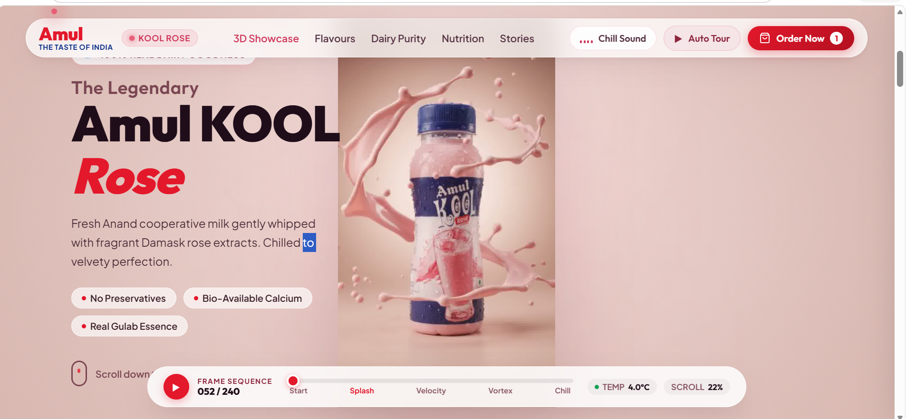

# Amul Kool Rose — Real Milk, Real Taste

An interactive, scroll-based 3D animated website built for **Amul Kool Rose**, showcasing the product through smooth frame-by-frame scroll animations and an engaging flavour selector.

**Live Demo:** [https://amul-kool-rose-kappa.vercel.app/]  
**GitHub Repo:** [https://github.com/hibak6457-jpg/amul-kool-rose]

---

## Preview

> Add a screenshot or GIF of your website here so visitors see it immediately.



## Features

-  **Scroll-triggered frame animation** — smooth 3D-style product reveal as the user scrolls
-  **Interactive Flavour Selector** — switch between flavours like Kesar and Badam
-  **Auto Tour / Play mode** — automatically animates the experience for the user
-  **Responsive design** — works across desktop and mobile screens
-  **Lightweight & fast** — built with vanilla JavaScript, no heavy frameworks

---

##  Tools & Technologies Used

| Category | Tool / Technology |
|---|---|
| Markup | HTML5 |
| Styling | CSS3 (Flexbox/Grid, animations) |
| Logic | JavaScript (Vanilla JS) |
| Local Server | Node.js (`server.js`) |
| Image Processing | Frame extraction from animation source (ezgif) |
| Development Environment | Google Antigravity IDE (AI agent-assisted development) |
| AI Model | Gemini 3.8 Flash |
| Version Control | Git & GitHub |
| Deployment | Netlify / Vercel *(update based on what you use)* |

---

## Folder Structure

```
amul-kool-rose/
├── index.html              # Main HTML file — entry point of the website
├── server.js                # Local Node.js server to run the project
├── package.json             # Project metadata & dependencies
├── README.md                 # Project documentation (this file)
├── .gitignore                # Files/folders excluded from Git
│
├── css/
│   └── style.css             # All styling, layout, and animation CSS
│
├── js/
│   └── script.js             # Scroll animation logic, flavour selector, interactivity
│
├── frames/
│   ├── frame-001.jpg         # Sequential animation frames
│   ├── frame-002.jpg
│   └── ...                   # Used for scroll-based frame animation
│
└── images/
    ├── logo.png               # Brand logo
    └── ...                    # Other static images/icons
```

---

## Getting Started

### Prerequisites
- [Node.js](https://nodejs.org/) installed on your system

### Installation & Running Locally

```bash
# 1. Clone the repository
git clone https://github.com/your-username/amul-kool-rose-website.git

# 2. Move into the project folder
cd amul-kool-rose-website

# 3. Install dependencies (if any)
npm install

# 4. Start the local server
node server.js

# 5. Open in browser
http://localhost:3000
```

---

##  How It Works

1. As the user scrolls, JavaScript calculates scroll position and updates the displayed animation frame in real time, creating a smooth 3D-like motion effect.
2. The **Flavour Selector** section lets users switch between product variants (e.g. Kesar, Badam), dynamically updating visuals.
3. An **Auto Tour** mode plays the animation automatically without requiring manual scrolling.

---

##  Future Improvements

- Add loading optimization for animation frames
- Add more flavour variants
- Improve mobile touch-scroll performance
- Add sound effects / background music toggle

---

## Author

**Hiba Khan**  
hibak6457@gmail.com
https://amul-kool-rose-kappa.vercel.app/

---
